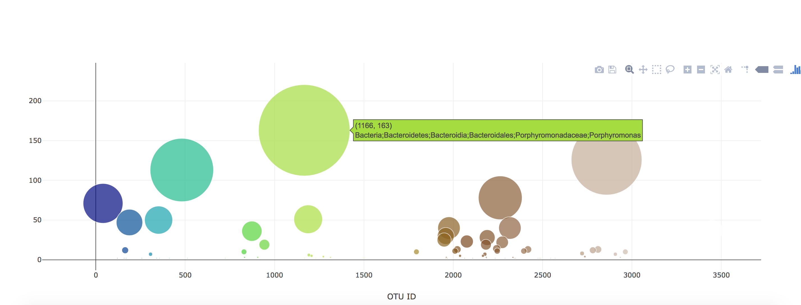

# Belly Button Biodiversity

Visit app at https://bellybutton-biodiversity-study.herokuapp.com/

This web application features an interactive dashboard to explore the [Belly Button Biodiversity DataSet](http://robdunnlab.com/projects/belly-button-biodiversity/).

* sample metadata from the route `/metadata/<sample>`of selected sample is displayed 

* plots updates any time that a new sample is selected.

## Part 1 - Plotly.js

Interactive charts for the dashboard were builed using Plotly.js. 
The charts updates everytime when selection of sample is made

* PIE chart uses data from amples route (`/samples/<sample>`) to display the top 10 samples.
 
  * `sample_values` as the values for the PIE chart

  * `otu_ids` as the labels for the pie chart

  * `otu_labels` as the hovertext for the chart

  

* Bubble Chart uses data from your samples route (`/samples/<sample>`) to display each sample.

  * `otu_ids` for the x values

  * `sample_values` for the y values

  * `sample_values` for the marker size

  * `otu_ids` for the marker colors

  * `otu_labels` for the text values

  

## Part 2 - Heroku

Flask app is deployed through Heroku.

- - -

## Part 3 - Gauge Chart

* Display Wash Frequency of a particular subject

* Gauge Chart adapted from <https://plot.ly/javascript/gauge-charts/> to plot the Weekly Washing Frequency obtained from the route `/wfreq/<sample>`

* chart updates whenever a new sample is selected

- - -

## Flask API

* Contains SQLAlchemy queries that obtain data from sample database and distribute them in JSON format into different Flask routes

* Data can be accessed by visiting corresbonding routes
 * "/names"  - display a list of all sample IDs
 * "/metadata/<sample>"  -  display information of subject for a given samle ID
 * "/samples/<sample>" -  display biodiveristy growth for a given sample ID
 * "/count"  -  dispaly total number count of bacteria growth per sample ID

